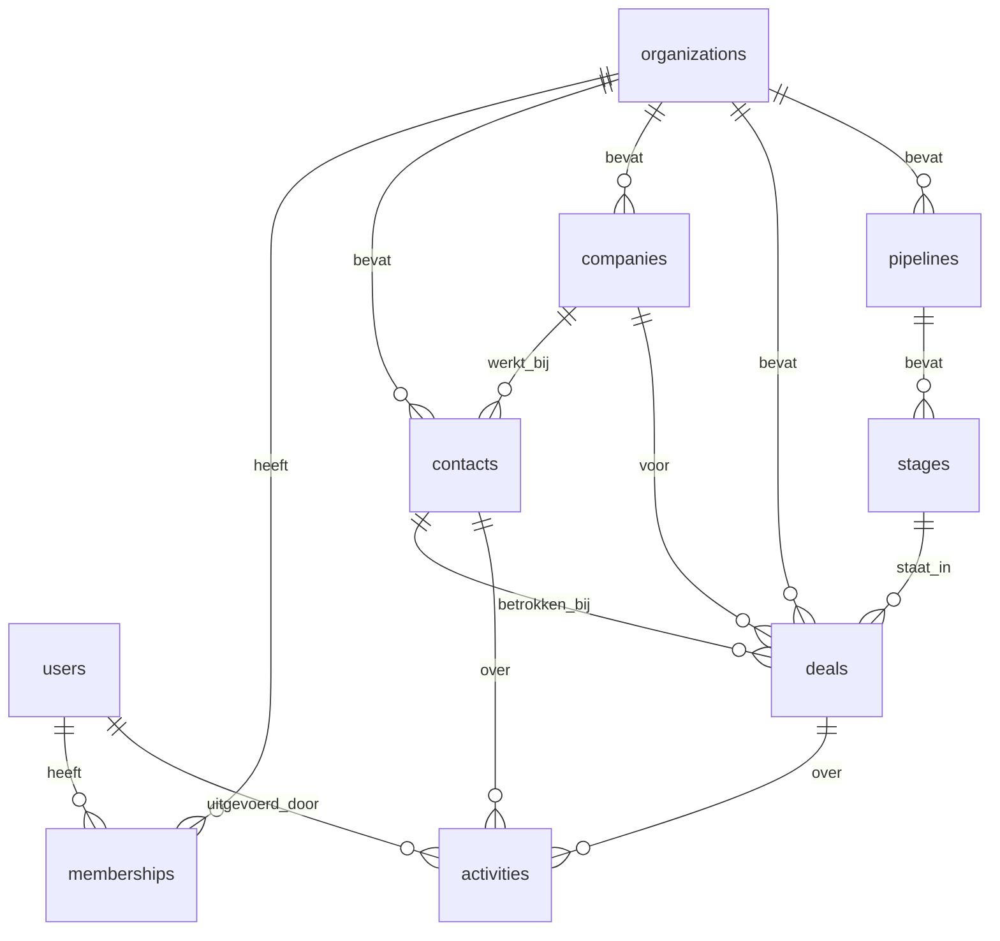

# Architectuur — Verkenners CRM

Een multi-tenant CRM-SaaS waar meerdere bedrijven (tenants) elk hun eigen,
strikt gescheiden data beheren. Dit document beschrijft de technische keuzes,
het datamodel en de bouwvolgorde.

> Status: ontwerp (v1). Beslissingen in §10 zijn leidend; wijzig dit document
> wanneer een keuze verandert.

---

## 1. Doel & scope

Een lichtgewicht CRM voor kleine teams binnen meerdere organisaties. Kern:
contacten, bedrijven, verkoopkansen (deals) in een pipeline, en activiteiten
(notities, taken, e-mails) op een tijdlijn.

**Niet** in scope voor v1: facturatie, e-mailcampagnes, mobiele app, publieke
API. De architectuur houdt hier wel ruimte voor (zie §6, services-laag).

---

## 2. Tech-stack

| Laag            | Keuze                          | Reden |
|-----------------|--------------------------------|-------|
| Framework       | Next.js (App Router)           | Full-stack: UI, Server Actions en API in één codebase |
| Taal            | TypeScript (`strict`)          | Type-veiligheid van UI tot database |
| Database        | PostgreSQL (Neon of Supabase)  | Relationeel model past bij CRM; Row-Level Security voor isolatie |
| ORM             | Drizzle ORM                    | Type-safe, SQL-dichtbij, werkt goed samen met RLS |
| Auth & tenants  | Clerk (met Organizations)      | Kant-en-klare login, uitnodigingen en multi-tenant org-beheer |
| UI              | Tailwind CSS + shadcn/ui       | Snel, consistent, volledige controle over componenten |
| Data fetching   | TanStack Query + Server Actions| Caching, mutaties en optimistic updates |
| Validatie       | Zod                            | Eén schema voor formulier, server-grens en DB |
| Hosting         | Vercel + managed Postgres      | Naadloos met Next.js; eenvoudige deploys en previews |

---

## 3. Multi-tenancy

**Model: shared database, shared schema, geïsoleerd met een `organization_id`
per rij + PostgreSQL Row-Level Security (RLS).**

Waarom deze aanpak:

- **Eenvoud & kosten** — één database en één migratiepad voor alle tenants.
- **Veiligheid in de diepte** — RLS filtert rijen in de database zélf. Vergeet
  je in code ooit een `WHERE organization_id = …`, dan lekt er nog steeds geen
  data tussen tenants. Dit is het vangnet, niet de enige verdediging.

Database-per-tenant bewaren we voor latere enterprise-klanten met harde
compliance-eisen; dat is dan een uitbreiding, geen herontwerp.

### Tenant-context per request

```
Request
  → Clerk: wie is de user en welke active organization?
  → orgId uit de sessie halen
  → DB-transactie openen en `SET LOCAL app.current_org = <orgId>`
  → RLS-policy laat alleen rijen toe waar organization_id = current_org
  → query/mutatie draait automatisch tenant-scoped
```

Elke databasetoegang loopt via één helper die deze context zet. Zo kan een
ontwikkelaar de scoping niet per ongeluk omzeilen.

### Mapping Clerk ↔ database

Clerk is de bron van waarheid voor *identiteit* (users, organizations,
memberships, uitnodigingen). We spiegelen het minimum naar onze database via
**webhooks** (`organization.created`, `user.created`, `organizationMembership.*`)
zodat we kunnen joinen op `organization_id` en `user_id`. Clerk-`orgId` en
`userId` zijn de primaire sleutels die we overnemen.

---

## 4. Datamodel



### Entiteiten

- **organizations** — een tenant (gespiegeld vanuit Clerk).
- **users** — een persoon met een login (gespiegeld vanuit Clerk).
- **memberships** — koppelt user aan organization met een `role`
  (`owner` / `admin` / `member`).
- **companies** — accounts/bedrijven waarmee de tenant zakendoet.
- **contacts** — personen, optioneel gekoppeld aan een company.
- **pipelines** + **stages** — configureerbare verkoopfases per tenant.
- **deals** — verkoopkansen met waarde, stage en eigenaar.
- **activities** — notities, taken, calls en e-mails op een tijdlijn,
  gekoppeld aan een contact en/of deal.

### Standaardkolommen (elke tabel)

| Kolom             | Type        | Opmerking |
|-------------------|-------------|-----------|
| `id`              | `uuid` (pk) | gegenereerd |
| `organization_id` | `text`/`uuid` (fk) | RLS-sleutel; index |
| `created_at`      | `timestamptz` | default `now()` |
| `updated_at`      | `timestamptz` | bijgewerkt via trigger/app |
| `created_by`      | `text` (fk users) | audit |
| `deleted_at`      | `timestamptz` null | soft-delete |

Index op `(organization_id, …)` voor de meest gebruikte queries.

---

## 5. Auth & autorisatie

- **Authenticatie**: Clerk (e-mail/wachtwoord, social login, magic links).
- **Organisaties & uitnodigingen**: Clerk Organizations — uitnodigen,
  rollen en "active organization" switchen zit er kant-en-klaar in.
- **Autorisatie (binnen een tenant)**: rol uit de membership bepaalt rechten.
  - `owner` — alles, inclusief org verwijderen en facturatie.
  - `admin` — beheer leden, pipelines, instellingen.
  - `member` — eigen CRM-werk: contacten, deals, activiteiten.
- Rolcontrole gebeurt in de **services-laag** (§6), niet in de UI. De UI
  verbergt alleen knoppen; de server beslist.

---

## 6. Applicatielagen

```
UI (React Server/Client Components)
      │  alleen presentatie + form-state
      ▼
Server Actions / API routes
      │  auth-check, tenant-context, Zod-validatie
      ▼
Services  (business-logica, framework-onafhankelijk)
      │  regels, rolcontrole, orchestratie
      ▼
Repositories / Drizzle  (tenant-scoped queries)
      ▼
PostgreSQL + RLS
```

**Kernprincipe**: alle business-logica leeft in `services/`, los van React.
Daardoor is de logica testbaar zonder browser en kun je er later een mobiele
app of publieke API bovenop zetten zonder de regels te dupliceren.

---

## 7. Projectstructuur

```
src/
  app/
    (marketing)/              # publieke landingspagina
    (auth)/                   # sign-in, sign-up (Clerk)
    (app)/                    # afgeschermd; Clerk vereist active org
      contacts/
      companies/
      deals/                  # kanban-board over de pipeline
      activities/
      settings/               # leden, rollen, pipelines
    api/
      webhooks/clerk/         # sync users/orgs naar DB
  server/
    db/
      schema/                 # Drizzle-tabellen
      migrations/
      client.ts               # tenant-scoped DB-helper (zet app.current_org)
    services/                 # business-logica per domein
    actions/                  # Server Actions (dunne laag → services)
  lib/
    auth.ts                   # Clerk-helpers, huidige org/user
    validation/               # Zod-schema's
  components/
    ui/                       # shadcn-componenten
    <domein>/                 # domeinspecifieke UI
```

---

## 8. Cross-cutting concerns

- **Validatie**: Zod aan elke server-grens; types afgeleid uit hetzelfde schema.
- **Foutafhandeling**: getypeerde resultaten (`Result`-patroon) uit services;
  geen ruwe excepties naar de UI.
- **Audit**: `created_by` + `updated_at`; later uitbreidbaar naar een
  `audit_log`-tabel.
- **Soft-delete**: `deleted_at`; standaard uitgefilterd in queries.
- **Migraties**: Drizzle Kit, versiebeheerd in de repo, in CI gedraaid.
- **Tests**: unit op services; integratie op repositories incl. een test die
  bewijst dat RLS cross-tenant toegang blokkeert.
- **Observability**: Vercel logs/analytics; later Sentry voor foutmeldingen.

---

## 9. Bouwvolgorde (fases)

1. **Fundament** — Next.js + Drizzle + Clerk; webhooks; één tabel + werkende
   RLS-isolatie aantonen met een test.
2. **Kern-CRUD** — companies & contacts (lijst, detail, aanmaken, bewerken).
3. **Sales** — pipelines/stages + deals als kanban-board.
4. **Activiteiten** — notities, taken en tijdlijn per contact/deal.
5. **Polish** — zoeken, filters, rollen/permissies fijnmazig, notificaties.

---

## 10. Belangrijkste beslissingen (samenvatting)

| # | Beslissing | Status |
|---|------------|--------|
| 1 | Web-app, multi-tenant SaaS | vast |
| 2 | Next.js (App Router) + TypeScript | vast |
| 3 | PostgreSQL + Drizzle ORM | vast |
| 4 | Tenant-isolatie via `organization_id` + RLS | vast |
| 5 | Clerk voor auth + Organizations | vast |
| 6 | Business-logica in services-laag | vast |
| 7 | Hosting op Vercel | voorgesteld |

---

## 11. Openstaande vragen

- Welke Postgres-host: Neon of Supabase? (Beide werken; Supabase geeft extra
  batterijen, Neon is puur Postgres + branching.)
- Hebben we vanaf v1 al maatwerkvelden (custom fields) per tenant nodig, of
  voldoende met een vast schema?
- Importeren we bestaande data (CSV) bij de start?
